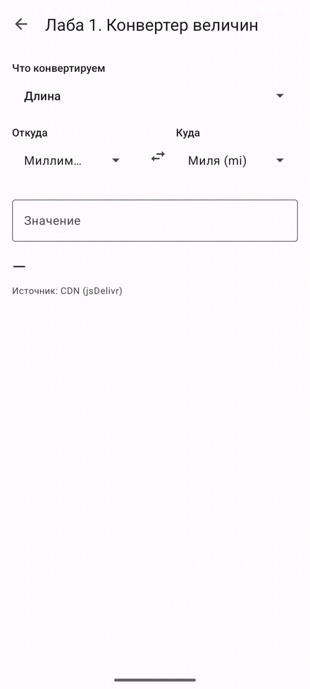
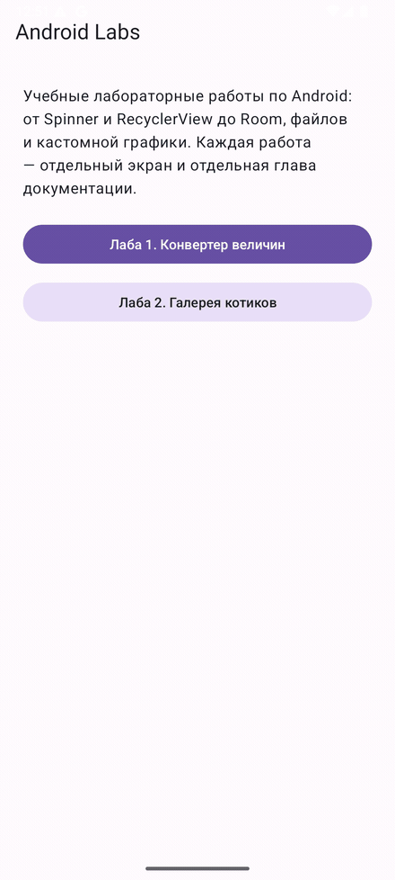
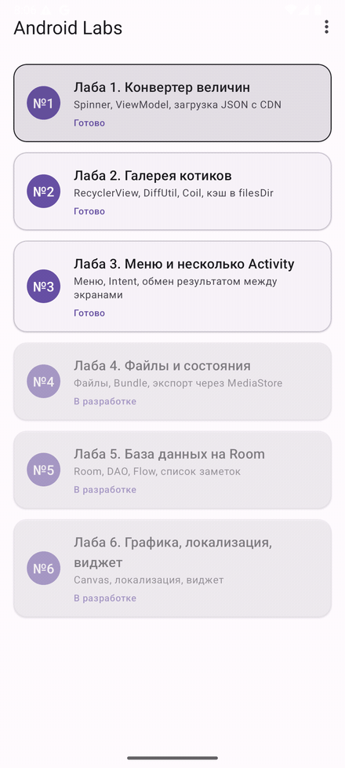
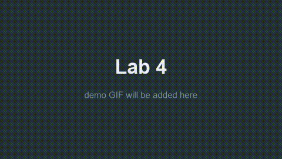
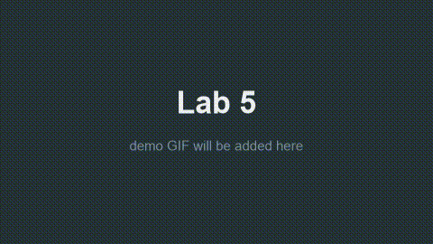
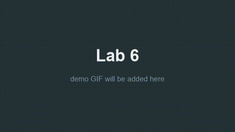

# Android-education

> Учебный Android-проект на Kotlin: **6 лабораторных работ в одном приложении**, каждая со своим
> разбором, граблями и пошаговым guide. Репозиторий задуман как наглядное пособие: по нему можно
> пройти весь путь от нуля до рабочего приложения и не повторить чужие ошибки.

<div align="center">

| Лаба | Тема | Документация | Статус | Тег |
|:----:|------|:-------------|:------:|:---:|
| 1 | Конвертер величин | [docs/01-lab-converter.md](docs/01-lab-converter.md) | ✅ | `lab1-v1.0` |
| 2 | Галерея котиков (CATAAS) | [docs/02-lab-cats-gallery.md](docs/02-lab-cats-gallery.md) | ✅ | `lab2-v1.0` |
| 3 | Меню, `Intent`, несколько Activity | [docs/03-lab-menu-activity.md](docs/03-lab-menu-activity.md) | 🔜 | `lab3-v1.0` |
| 4 | Файлы, кэш, сохранение состояния | [docs/04-lab-files-state.md](docs/04-lab-files-state.md) | 🔜 | `lab4-v1.0` |
| 5 | Room: заметки | [docs/05-lab-room.md](docs/05-lab-room.md) | 🔜 | `lab5-v1.0` |
| 6 | Графика, локализация, виджет | [docs/06-lab-canvas-widget.md](docs/06-lab-canvas-widget.md) | 🔜 | `lab6-v1.0` |

</div>

---

## 📸 Скриншоты

> Заполняются по мере прохождения лаб. Файлы лежат в [`docs/assets/`](docs/assets/).
> Показанные GIF — реальные прогоны на эмуляторе; у ещё не сделанных лаб стоят заглушки.

| Лаба | Демо |
|:----:|------|
| 1 |  |
| 2 |  |
| 3 |  |
| 4 |  |
| 5 |  |
| 6 |  |

---

## 🚀 Быстрый старт

```bash
git clone https://github.com/devcustrom/Android-education.git
cd Android-education/android
./gradlew assembleDebug
```

APK соберётся в `android/app/build/outputs/apk/debug/app-debug.apk`.

Открыть проект в Android Studio: **File → Open** → выбрать папку `Android-education/android`
(именно `android/`, а не корень репозитория — так Gradle не потеряет settings-файл).

Подробная инструкция, включая настройку эмулятора и решение проблем с AGP/Gradle —
в **[docs/00-setup.md](docs/00-setup.md)**.

---

## 🛠 Стек

| Слой | Технология |
|------|------------|
| Язык | Kotlin (встроен в AGP 9 — отдельный плагин `kotlin-android` не нужен) |
| UI | View Binding (**не** Data Binding), Material 3, ConstraintLayout |
| Архитектура | Activity + ViewModel + `StateFlow` |
| Асинхронность | Coroutines + Flow |
| Сеть | OkHttp + kotlinx.serialization (**без** Retrofit) |
| Картинки | Coil |
| БД | Room + KSP (Лаба 5) |
| Сборка | AGP 9.4.1, Gradle 9.6.0, version catalog |

Версии библиотек **намеренно зафиксированы**. Правило репозитория: *«заработало — не чини»*.
Если что-то не собирается — понижаем версию библиотеки, а не трогаем AGP/Gradle.

| Параметр | Значение |
|----------|----------|
| `minSdk` | 24 (Android 7.0) |
| `compileSdk` / `targetSdk` | 37 |
| AGP | 9.4.1 |
| Gradle | 9.6.0 |
| Kotlin (встроенный) | 2.2.10 |

---

## 📂 Структура репозитория

```
Android-education/
├── README.md                  ← ты здесь
├── CHANGELOG.md
├── LICENSE                    ← MIT
├── Plan.md                    ← план-техзадание, по которому сделан репозиторий
├── docs/                      ← вся документация на русском
│   ├── 00-setup.md            ← установка, эмулятор, решение проблем
│   ├── 01-lab-converter.md
│   ├── 02-lab-cats-gallery.md
│   ├── 03-lab-menu-activity.md
│   ├── 04-lab-files-state.md
│   ├── 05-lab-room.md
│   ├── 06-lab-canvas-widget.md
│   └── assets/                ← скриншоты и GIF-демонстрации
├── android/                   ← Gradle-проект (открывать в Android Studio)
│   ├── gradle/libs.versions.toml   ← все версии библиотек в одном месте
│   └── app/src/main/
│       ├── AndroidManifest.xml
│       ├── java/ru/devcustrom/androidlab/
│       │   ├── MainActivity.kt      ← список всех лаб (Лаба 3)
│       │   ├── common/              ← общие модели
│       │   ├── data/
│       │   │   ├── model/           ← Unit, Cat, ...
│       │   │   ├── network/         ← OkHttp-клиенты
│       │   │   ├── repository/      ← сеть + кэш
│       │   │   └── db/              ← Room (Лаба 5)
│       │   ├── ui/                  ← ViewModel-ы
│       │   ├── lab1/ … lab6/        ← код каждой лабы
│       │   └── assets/              ← офлайн-копии data/*.json
│       └── res/
└── data/                      ← данные, которые приложение тянет с CDN
    ├── units.json             ← единицы величин для Лабы 1
    └── cats_fallback.json     ← офлайн-заглушка для Лабы 2
```

---

## 🧭 Как читать репозиторий

1. **Хотите понять, «с чего начинать»** → [docs/00-setup.md](docs/00-setup.md), затем Лаба 1.
2. **Хотите конкретную тему** → идите в `docs/NN-lab-*.md` по нужной лабе. Каждый документ
   написан по одному шаблону: цель → теория → пошаговая реализация → **грабли** → разбор решений →
   чек-лист сдачи.
3. **Хотите посмотреть код** → `android/app/src/main/java/ru/devcustrom/androidlab/labN/`.
   Код сознательно «учебный»: без лишних абстракций, с комментариями в неочевидных местах.
4. **Хотите понять, почему так, а не иначе** → раздел «🤔 Разбор решений» в каждой лабе.

### Что в репозитории ценного

Раздел **«🐛 Что пошло не так (грабли)»** в каждой лабе — не формальность. Туда записываются
реальные ошибки, которые пришлось устранить: несовместимые версии AGP и Kotlin, `NetworkOnMainThreadException`,
`NullPointerException` в `Adapter`, потеря состояния при повороте экрана и другие. Ошибки
**не удаляются** после исправления — это и есть основная ценность репозитория.

Данные не захардкожены: всё, что можно, лежит в `data/*.json` и раздаётся через
[jsDelivr](https://www.jsdelivr.com/), либо приходит из внешнего API ([CATAAS](https://cataas.com/)).

---

## 📄 Лицензия

[MIT](LICENSE). Код и документация — можно свободно использовать в учебных целях.