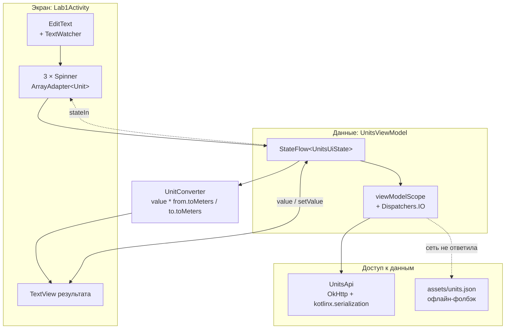

# Лабораторная 1. Конвертер величин на `Spinner`

> **Сложность:** начальная · **Время:** 1.5–2 часа · **Тег:** `lab1-v1.0`
> **Итог:** приложение умеет конвертировать длину, массу и объём, подгружая справочник
> единиц с CDN, а при отсутствии сети — из `assets`.


---

## 🎯 Цель работы

> Написать приложение-конвертер величин: пользователь выбирает категорию (длина, масса,
> объём), единицу «откуда» и «куда», вводит число и получает результат. Справочник единиц
> загружается с CDN, при отсутствии сети используется встроенная копия из `assets`.

| | |
|---|---|
| **Что делаем** | Экран с тремя `Spinner`: группа величин, «откуда» и «куда». Пользователь вводит число и видит результат |
| **Чему учимся** | `Spinner` и `ArrayAdapter`, `ViewModel` + `StateFlow`, загрузка JSON через OkHttp, офлайн-фолбэк, восстановление состояния при повороте |
| **Итоговый навык** | Понимать, где в Android «плоть» (Activity), а где — данные (ViewModel), и почему формулу надо выносить в отдельный объект |

## 📚 Что изучим

- `Spinner`, `AdapterView.OnItemSelectedListener`, `ArrayAdapter` и его `getDropDownView()`
- `ViewModel` + `viewModelScope` + `StateFlow` как способ пережить поворот экрана
- `TextWatcher`: почему `EditText` нельзя читать один раз в `onCreate`
- OkHttp и `kotlinx.serialization`: `ignoreUnknownKeys`, `explicitNulls`
- Разделение «сеть» (`UnitsApi`) и «данные» (`UnitsViewModel`)
- `UnitConverter` — чистый Kotlin-класс, который можно тестировать без Android

---

## 🖼️ Что получится


| Экран | Скриншот |
|-------|----------|
| Работа с единицами |  |
| Результат конвертации |  |
| Офлайн-режим из `assets` |  |

---

## 🧠 Архитектура



Ключевая идея: `Lab1Activity` **не знает**, откуда пришли единицы — из сети или из
`assets`. Она подписана на `StateFlow` и просто рисует то, что получила. Источник
данных — деталь репозитория, а не экрана.

---

## 🧠 Теория

| Параметр | Значение |
|----------|----------|
| **Формат ввода** | Целое или дробное число, допускается запятая |
| **Точность** | До 6 знаков после запятой, лишние нули отбрасываются |
| **Источник** | CDN `cdn.jsdelivr.net` → `assets/units.json` |

### 1.1 Что такое `Spinner`

`Spinner` — это выпадающий список, реализованный поверх `AdapterView`. Он хранит данные
не в самом `Spinner`, а в **`Adapter`**. Отсюда главное правило:

> `Spinner` не умеет хранить данные. Он умеет показывать то, что ему отдал адаптер,
> и сообщать, какой элемент выбрали.

Цепочка вызовов выглядит так:

```
пользователь тапает по Spinner
        ↓
Spinner просит у адаптера элемент №3: getView(3, …)
        ↓
Adapter раздувает item_unit.xml и заполняет TextView
        ↓
показывает пользователю
```

### 1.2 Почему `ArrayAdapter`, а не «просто список»

`ArrayAdapter` — готовый адаптер, который умеет три вещи «из коробки»:

1. хранить массив и отдавать элемент по индексу;
2. сортировать, если элементы реализуют `Comparable`;
3. фильтровать через `Filter`.

Всё, что он делает из коробки, **медленное**, и это нормально для списка из 20 строк.
Когда списки становятся большими, нужен `RecyclerView` — это Лаба 2.

### 1.3 Главная грабля №1: `toString()` вместо разметки

Если не переопределить `getView()`, `ArrayAdapter` покажет пользователю
`data class.toString()`:

```
Unit(id=cm, name=Сантиметр, short=см, kind=length, toMeters=0.01)
```

Это не баг — это поведение `ArrayAdapter` по умолчанию: он создаёт `TextView` и
вызывает на элементе `toString()`. Поэтому в коде есть две переопределённые функции:

```kotlin
override fun getView(position: Int, convertView: View?, parent: ViewGroup): View {
    val view = convertView ?: inflater.inflate(R.layout.item_unit, parent, false)
    view.findViewById<TextView>(R.id.unitTitle).text = getItem(position)?.label.orEmpty()
    return view
}

override fun getDropDownView(position: Int, convertView: View?, parent: ViewGroup): View =
    getView(position, convertView, parent)
```

`getDropDownView` нужен обязательно: без него **выпадающий список** продолжит
показывать `toString()`, даже когда основной элемент выглядит правильно. Это тот случай,
когда приложение «вроде всё сделал, а список всё равно кривой».

### 1.4 Где брать данные: CDN против `assets`

Справочник лежит в репозитории — в файле [`data/units.json`](../data/units.json).
Приложение тянет его по ссылке

```
https://cdn.jsdelivr.net/gh/devcustrom/Android-education@main/data/units.json
```

Смысл такого подхода: файл можно править обычным коммитом, а приложение подхватит
изменения без новой публикации в Google Play.

Но ссылка может не ответить (нет сети, CDN ещё не закешировал свежий коммит).
Поэтому в `UnitsApi` два источника, и второй — копия того же файла внутри APK:

```kotlin
suspend fun loadUnits(): Payload = withContext(Dispatchers.IO) {
    val fromCdn = runCatching { requestUnits() }.getOrNull()
    if (!fromCdn.isNullOrEmpty()) {
        Payload(fromCdn, Source.CDN)
    } else {
        Payload(readFromAssets(), Source.ASSETS)
    }
}
```

Копия лежит в `android/app/src/main/assets/units.json` и попадает в APK автоматически.

> ⚠️ Не забывайте обновлять копию в `assets` после правки `data/units.json`.
> Копия сделана вручную, Gradle за ней не следит.

### 1.5 Формула перевода

Для любой группы величин достаточно одного правила:

```
результат = значение × from.toMeters / to.toMeters
```

Смысл `toMeters`: *сколько базовых единиц своей группы содержится в одной этой единице*.
Для длины базовая единица — метр, поэтому у сантиметра `toMeters = 0.01`.
Для массы базовая — килограмм, для объёма — литр, но формула от этого не меняется:
она всегда приводит к базе своей группы и обратно.

Отсюда же ограничение: **конвертировать можно только внутри одной группы**.
`UnitConverter` проверяет это и бросает `IllegalArgumentException`.

### 1.6 Почему `StateFlow`, а не просто поле

`UnitsViewModel` отдаёт состояние через `StateFlow<UnitsUiState>`, где состояние — это
`sealed interface`:

```kotlin
sealed interface UnitsUiState {
    data object Loading : UnitsUiState
    data class Ready(val groups: List<UnitGroup>, val source: UnitsApi.Source) : UnitsUiState
    data class Error(val message: String) : UnitsUiState
}
```

`sealed` гарантирует, что все варианты перечислены: добавите новый — компилятор
напомнит про все `when`. Экран подписывается так:

```kotlin
lifecycleScope.launch {
    repeatOnLifecycle(Lifecycle.State.STARTED) {
        viewModel.state.collect { state -> /* … */ }
    }
}
```

`repeatOnLifecycle` останавливает сбор при уходе экрана в фон и перезапускает при
возврате. Без него подписка живёт до уничтожения Activity и удерживает её в памяти.

---

## 🛠 Реализация

### Шаг 0. Что уже было готово

Проект к началу лабы уже собран и проходит smoke-тест (см. [00-setup.md](00-setup.md)):
Gradle 9.6 + AGP 9.4.1, Kotlin 2.2.10, View Binding, корутины, OkHttp,
kotlinx.serialization и Coil уже подключены и проверены сборкой.

### Шаг 1. Модель

[`data/model/Unit.kt`](../android/app/src/main/java/ru/devcustrom/androidlab/data/model/Unit.kt):

```kotlin
@Serializable
data class Unit(
    val id: String,
    val name: String,
    val short: String,
    val kind: String,
    val toMeters: Double,
) {
    val label: String get() = "$name ($short)"
}

enum class UnitKind(val id: String, val titleRes: String) {
    LENGTH("length", "kind_length"),
    MASS("mass", "kind_mass"),
    VOLUME("volume", "kind_volume"),
}
```

`kind` хранится строкой, а не `UnitKind`, потому что он приходит из JSON. `UnitKind`
нужен только на стороне приложения — для заголовков и группировки.

> 💡 Имя поля `toMeters` историческое. Когда в лабе были только метры, оно буквально
> означало «сколько метров в единице». С появлением массы и объёма точнее было бы
> `toBase`, но переименовывать поле ради красоты словаря не стали — чтобы
> документация и план лабы не расходились. Смысл не изменился.

### Шаг 2. Чтение JSON

Настройки `Json` — отдельный класс, потому что флагов тут два:

```kotlin
private val json = Json {
    ignoreUnknownKeys = true
    isLenient = true
}
```

`ignoreUnknownKeys` — обязателен. В `units.json` есть поле `comment`, о котором модель
не знает. Без этого флага kotlinx.serialization бросит `SerializationException` на
любом лишнем поле. Это самая частая причина «работало у автора, не работает у меня».

### Шаг 3. ViewModel

[`ui/UnitsViewModel.kt`](../android/app/src/main/java/ru/devcustrom/androidlab/ui/UnitsViewModel.kt)
держит состояние и группирует единицы по `kind`. `ViewModel` не знает ни про один
`View` — это позволяет пережить поворот экрана и не тестировать его UI-тестами.

### Шаг 4. Адаптеры

[`lab1/UnitAdapter.kt`](../android/app/src/main/java/ru/devcustrom/androidlab/lab1/UnitAdapter.kt) —
`ArrayAdapter` с переопределёнными `getView`/`getDropDownView`. Разметки — отдельные
`item_unit.xml` и `item_kind.xml`, чтобы у списка групп и списка единиц была своя вёрстка.

### Шаг 5. Формула отдельно

[`lab1/UnitConverter.kt`](../android/app/src/main/java/ru/devcustrom/androidlab/lab1/UnitConverter.kt) —
`object` без единой Android-зависимости. Благодаря этому вся арифметика проверяется
обычными тестами, без эмулятора:

```kotlin
@Test
fun `2 сантиметра это 20 миллиметров`() {
    assertEquals(20.0, UnitConverter.convert(2.0, centimeter, millimeter), 1e-9)
}
```

### Шаг 6. Activity

[`lab1/Lab1Activity.kt`](../android/app/src/main/java/ru/devcustrom/androidlab/lab1/Lab1Activity.kt)
только подписывается на `StateFlow` и перерисовывает view. Проверка «выбраны ли
единицы» сделана на `selectedItem as? Unit` — безопасным приведением, потому что
`selectedItem` возвращает `Any?`.

### Шаг 7. Вход в лабу

`MainActivity` пока временно содержит одну кнопку — в Лабе 3 здесь будет список всех
работ.

---

## 🐛 Что пошло не так (грабли)

### Грабля 1. `Spinner` показал `data class` вместо названия

**Симптом:** вместо «Сантиметр (см)» на экране
`Unit(id=cm, name=Сантиметр, short=см, kind=length, toMeters=0.01)`.

**Причина:** `ArrayAdapter` по умолчанию берёт `toString()` элемента.

**Что сделано:** переопределён `getView()`.

### Грабля 2. Выпадающий список остался «кривым», хотя основной — исправился

**Симптом:** закрытый `Spinner` показывает нормальный текст, а раскрытый список —
внутренности `data class`.

**Причина:** у `getDropDownView()` есть собственная реализация по умолчанию, которая
про `getView()` не знает.

**Что сделано:** `getDropDownView()` тоже переопределён, причём он просто вызывает
`getView()` — разметка элемента одна и та же.

### Грабля 3. `kotlin.Unit` перестал быть `kotlin.Unit`

**Симптом:** компилятор ругается на
`Return type of 'onNothingSelected' is not a subtype of … 'fun onNothingSelected(…): Unit'`.

**Причина:** в файле есть `import ru.devcustrom.androidlab.data.model.Unit`, и в
`onNothingSelected { }` слово `Unit` начало резолвиться в **наш data class**, а не в
`kotlin.Unit`. Реальный конфликт имён.

**Что сделано:** тело функции переписано в блочный вид `{ }`, где результат —
настоящий `kotlin.Unit`. Переименовать модель в `MeasurementUnit` тоже можно, но тогда
придётся править все импорты.

> ⚠️ Общее правило: **не называйте свои классы `Unit`, `Result`, `State`, `Error`,
> `Action`, `Event`.** Эти имена заняты типами Kotlin-стандартной библиотеки.

### Грабля 4. После поворота экрана `Spinner` становились пустыми

**Симптом:** поворачиваем телефон — группа и введённое число на месте, а оба списка
единиц пустые, результат исчезает.

**Причина:** в `onKindSelected()` стояла защита

```kotlin
if (selectedKind == group.kind) return   // «группа не менялась — делать ничего не надо»
```

При повороте `selectedKind` восстанавливался из `savedInstanceState`, а список групп
приходил из сети позже. Защита срабатывала, и адаптеры `Spinner` так и не создавались.

**Что сделано:** убрана ранняя проверка. Метод `bindGroup()` стал идемпотентным: он
всегда пересоздаёт адаптеры и восстанавливает позиции по сохранённым `id` единиц.

### Грабля 5. Сохраняли позицию вместо идентификатора

**Симптом:** тот же баг, но intermittent: восстанавливалась не та единица, если
порядок в JSON отличался от прошлого раза.

**Причина:** позиция в списке — не идентификатор. Между двумя запусками порядок
может измениться, и индекс начнёт указывать на другую единицу.

**Что сделано:** в `Bundle` кладём `from.id` и `to.id`, а позицию вычисляем заново
через `indexOfFirst { it.id == … }`.

### Грабля 6. Тест сначала упал из-за моей же ошибки

**Симптом:** `expected:<-50.0> but was:<-500.0>`.

**Причина:** в тесте было написано «−5 метров это −50 сантиметров». На самом деле
−5 м это −500 см. Ошибка была в ожидаемом значении, а не в коде.

**Что сделано:** исправлено ожидаемое значение. Тест — не формальность: он поймал
ошибку раньше, чем её увидел бы пользователь.

### Грабля 7. Экран «зависал» на пустом месте при отсутствии сети

**Симптом:** без интернета приложение молчит.

**Причина:** как выяснилось, не зависает — просто `statusText` не содержал подсказки
об источнике данных, и отличить «грузятся» от «не грузятся» было невозможно.

**Что сделано:** внизу экрана всегда показано, откуда взялись данные —
`Источник: CDN (jsDelivr)` или `Источник: assets (офлайн-копия)`.


### Грабля 8. `jsDelivr` отдаёт 404, пока данные не в `main`

**Симптом:** `HTTP 404` по ссылке на файл, который точно есть в репозитории.

**Причина:** CDN читает ветку `main` на сервере GitHub. Пока файл лежит только
в локальном коммите — его нет по ссылке.

**Что сделано:** `data/units.json` закоммичен и отправлен в `origin/main` **до**
написания приложения. Учтите: CDN кэширует ответы, поэтому после правки файла
замена видна не сразу.

---

## 🤔 Разбор решений

| Решение | Почему так | Что было бы вместо |
|---------|-----------|-------------------|
| Данные в `data/units.json` + CDN | Правка коммитом, без публикации APK | Хардкод списка в `strings.xml` |
| `assets`-фолбэк | Приложение работает без сети | Показ ошибки пользователю |
| `sealed interface` + `StateFlow` | Компилятор проверяет все ветки `when` | Три отдельных `LiveData` |
| `UnitConverter` как `object` | Тестируется без эмулятора | Формула внутри `Activity` |
| Сохранение `id`, а не позиции | Порядок может измениться | `putInt("position", index)` |
| `repeatOnLifecycle` | Подписка живёт только пока экран видим | `lifecycleScope.launch { collect }` |
| Общий `OkHttpClient` | Один пул соединений на приложение | `OkHttpClient()` на каждый запрос |

---

## 🧪 Как проверить

```bash
cd android
./gradlew test          # 11 unit-тестов формулы и форматирования
./gradlew assembleDebug
```

Ручная проверка на эмуляторе:

1. Открыть **Лаба 1** → внизу должно быть `Источник: CDN (jsDelivr)`.
2. Выбрать группу **Масса**, «Откуда» → **Килограмм**, «Куда» → **Грамм**.
3. Ввести `2.5` → должно получиться `2.5 кг = 2500 г`.
4. Нажать кнопку обмена (⇄) → `2.5 г = 0.0025 кг`.
5. Ввести `abc` → поле покажет ошибку «Введите число».
6. Повернуть экран → группа, единицы и число должны остаться на месте.
7. Выключить интернет (`adb shell svc wifi disable`) и перезапустить →
   `Источник: assets (офлайн-копия)`.


---

## ✅ Чек-лист сдачи

- [ ] `data/units.json` содержит минимум 19 единиц в 3 группах
- [ ] Есть копия файла в `android/app/src/main/assets/`
- [ ] Список показывает названия, а не `toString()` модели
- [ ] Раскрывающийся список показывает названия
- [ ] Конвертация работает внутри группы
- [ ] Попытка конвертировать длину в массу приводит к ошибке, а не к «0»
- [ ] При повороте экрана не теряются группа, единицы и введённое число
- [ ] Без сети приложение работает и честно пишет, что взяло данные из `assets`
- [ ] `./gradlew test` — зелёные
- [ ] Скриншоты и GIF лежат в `docs/assets/`

---

## 🔗 Полезные ссылки

- [Документация `Spinner`](https://developer.android.com/develop/ui/views/components/spinner)
- [`AdapterView.OnItemSelectedListener`](https://developer.android.com/reference/android/widget/AdapterView.OnItemSelectedListener)
- [Обзор `ViewModel`](https://developer.android.com/topic/libraries/architecture/viewmodel)
- [`StateFlow`](https://developer.android.com/kotlin/flow/stateflow) и жизненный цикл `repeatOnLifecycle`
- [OkHttp: рецепты](https://square.github.io/okhttp/recipes/)
- [kotlinx.serialization: обработка ошибок](https://github.com/Kotlin/kotlinx.serialization/blob/master/docs/serializers.md)
- [Как работает `AppCompatActivity` при повороте экрана](https://developer.android.com/guide/components/activities/config-changes)

---

## 📌 Коммиты лабы

| Хэш | Описание |
|-----|----------|
| `4ae573c` | Лаба 1: конвертер величин на `Spinner`, 11 unit-тестов, документация |
| `e8155b9` | Исключить `.idea` из репозитория |
| `lab1-v1.0` | Тег: Лаба 1 завершена |

> ⚠️ Расхождение с `Plan.md`: в разделе 6 указано «`ListView` для Лаб 1–2», но пункт `B2`
> требует `Spinner`, а `C2` — `RecyclerView`. Следовал пунктам `B2`/`C2`, потому что они
> конкретнее и уже реализованы; переписывать работающую лабу под противоречивую строку
> не стал.