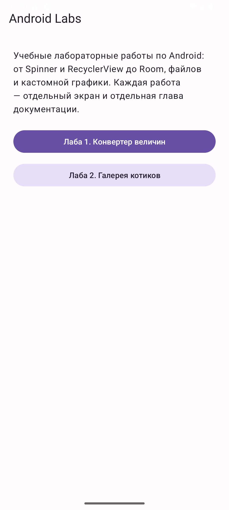
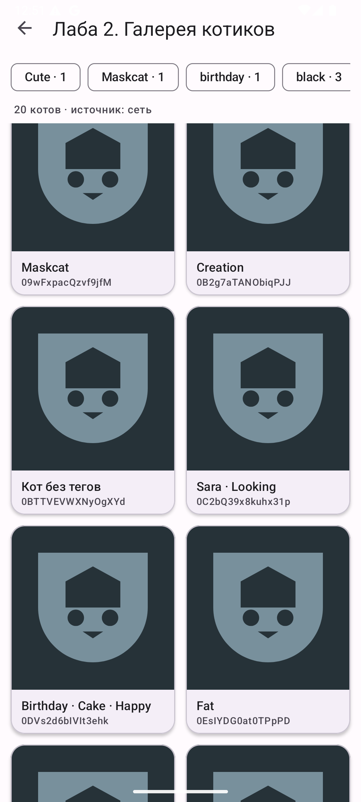
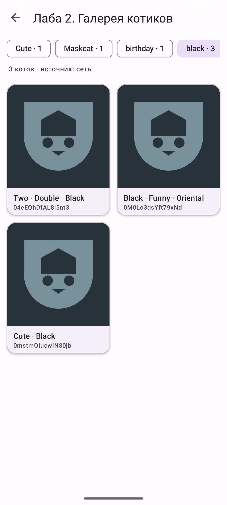
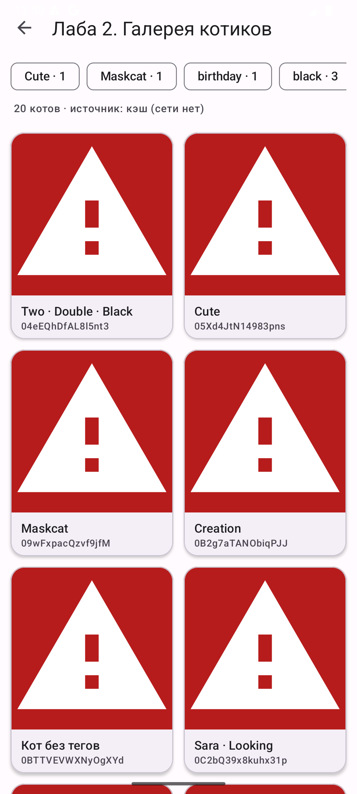
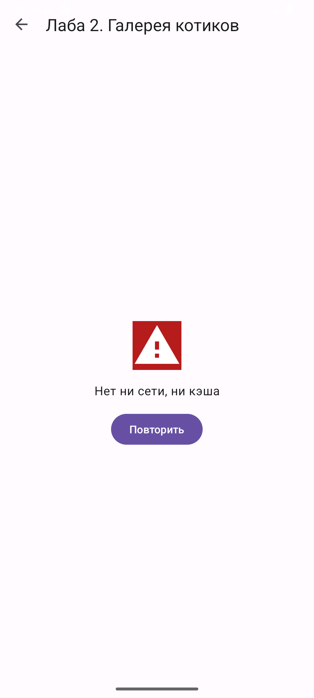
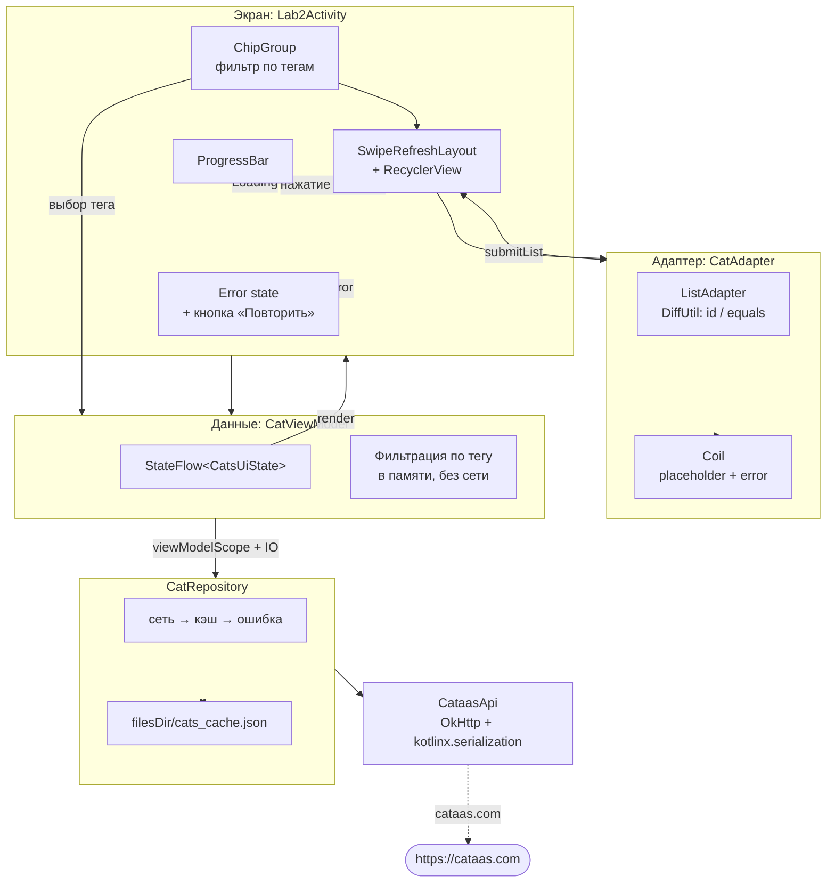

# Лабораторная 2. Галерея котиков: `RecyclerView`, `DiffUtil`, Coil

> **Сложность:** средняя · **Время:** 2.5–3.5 часа · **Тег:** `lab2-v1.0`
> **Итог:** приложение грузит 20 котов с [CATAAS](https://cataas.com/), показывает их сеткой,
> фильтрует по тегам, кэширует ответ на диск и переживает отсутствие сети.


---

## 🎯 Цель работы

> Сделать экран-галерею: приложение запрашивает 20 котов с [CATAAS](https://cataas.com/),
> показывает их сеткой карточек, позволяет фильтровать по тегам и переживает отсутствие
> сети за счёт дискового кэша.

| | |
|---|---|
| **Что делаем** | Сетка карточек с котами, фильтр по тегам, pull-to-refresh, состояние ошибки с кнопкой «Повторить» |
| **Чему учимся** | `RecyclerView` и переиспользование view, `ListAdapter` + `DiffUtil`, Coil для картинок, разделение «сеть» и «экран», файл-кэш в `filesDir` |
| **Итоговый навык** | Понимать, почему список на 2000 элементов нельзя обновлять через `notifyDataSetChanged()` и почему картинку не надо грузить самому |

## 📚 Что изучим

- `RecyclerView` и `ViewHolder`: переиспользование `View` вместо создания новых
- `LayoutManager` и сетка: `GridLayoutManager` с числом столбцов
- `ListAdapter` + `DiffUtil`: `areItemsTheSame` против `areContentsTheSame`
- Coil: `load()`, `placeholder`, `error`, `crossfade`, дисковый кэш
- `StateFlow` и три состояния экрана: `Loading` / `Success` / `Error` плюс `refreshing`
- Файл-кэш в `filesDir` и разница между `filesDir`, `cacheDir` и `externalCacheDir`
- Локальная фильтрация без повторного сетевого запроса
- Русские окончания через `plurals` и почему ручная арифметика — плохая идея

---

## 🖼️ Что получится


| Экран | Скриншот |
|-------|----------|
| Загрузка |  |
| Галерея |  |
| Фильтр по тегу |  |
| Данные из кэша |  |
| Ошибка |  |

---

## 🧠 Архитектура



Два ключевых решения, видных на схеме:

1. **Фильтрация живёт в `CatViewModel`, а не в `Lab2Activity`.** Переключение чипа не
   ходит в сеть, а меняет `StateFlow` — экран только перерисовывается.
2. **Репозиторий возвращает `LoadResult`, а не «просто список».** Экрану нужно знать,
   откуда взялись данные, чтобы честно написать «источник: кэш (сети нет)».

---

## 📚 Теория

### 2.1 Зачем вообще `RecyclerView`

`ListView` показывает все элементы сразу: 20 котов — ок, 20 000 — нет, список
раздует память и приложение упадёт.

`RecyclerView` держит на экране **только то, что видно**, плюс небольшой запас.
Как только карточка ушла за верхний край, её `View` не уничтожается, а
**сбрасывается и переиспользуется** для следующей карточки. Отсюда главное
правило адаптера:

> В `onBindViewHolder` нельзя рассчитывать, что перед вами «тот самый» элемент.
> Можно рассчитывать только, что `View` **подойдёт** для этого элемента.

### 2.2 `ListAdapter` и `DiffUtil`

Обычный `RecyclerView.Adapter` при обновлении данных требует ручного вызова
`notifyDataSetChanged()` — и это пересоздаёт **все** видимые элементы. Для
двух котов незаметно, для двух тысяч — это подтормаживание при каждом чихе.

`ListAdapter` делает работу за нас: он хранит старый и новый список, запускает
`DiffUtil` **в фоновом потоке** и перерисовывает только изменившееся.

Два метода, которые путают чаще всего:

```kotlin
override fun areItemsTheSame(oldItem: Cat, newItem: Cat): Boolean =
    oldItem.id == newItem.id            // это про ИДЕНТИЧНОСТЬ

override fun areContentsTheSame(oldItem: Cat, newItem: Cat): Boolean =
    oldItem == newItem                  // а это про СОДЕРЖИМОЕ
```

`areItemsTheSame` **нельзя** реализовать сравнением позиций. Представьте: кот по
имени «Сара» был на позиции 5, а после обновления попал на позицию 3. Если
сравнивать индексы, Android решит, что это два разных кота, и пересоздаст обе
карточки вместо перестановки.

### 2.3 Coil: почему не грузим картинки сами

Чтобы показать картинку по URL, нужно: скачать байты, определить формат,
отправить в декодер, распаковать в `Bitmap`, положить в `ImageView` — и всё это
**не в главном потоке**. Плюс кэш, чтобы не качать одно и то же дважды.

Coil делает это одной строкой:

```kotlin
binding.catImage.load(cat.imageUrl) {
    crossfade(true)
    placeholder(R.drawable.cat_placeholder)
    error(R.drawable.cat_error)
}
```

`placeholder` показывается, пока идёт загрузка; `error` — если она провалилась.
**Без `error` пользователь увидит пустое место** и не поймёт, что произошло.

### 2.4 Сеть не в главном потоке

Android запрещает сетевые вызовы из главного потока — упадёт
`NetworkOnMainThreadException`. OkHttp умеет асинхронность сам
(`enqueue(Callback)`), но читается это хуже, чем обычный последовательный код.

В проекте выбран второй путь: `suspend`-функция, внутри которой синхронный вызов
OkHttp обёрнут в `withContext(Dispatchers.IO)`. Поведение асинхронное — код
выглядит прямым.

### 2.5 Три состояния экрана

Галерея умеет ровно три состояния, и все три нужно уметь показывать:

```
Loading  ──ок──►  Success
   │                   │
   └──ошибка──►  Error ┘──«Повторить»──► Loading
```

Отдельное состояние `refreshing` нужно, чтобы отличить первую загрузку
(показать крутилку на весь экран) от pull-to-refresh (оставить список на месте
и показать индикатор внизу). Если их не различать, список при обновлении
моргает пустотой — это самая заметная ошибка в таких экранах.

---

## 🛠 Реализация

### Шаг 1. Модель и почему их две

[`data/model/Cat.kt`](../android/app/src/main/java/ru/devcustrom/androidlab/data/model/Cat.kt):

```kotlin
@Serializable
data class Cat(
    val id: String,
    val tags: List<String> = emptyList(),
    val mimetype: String = "",
    val createdAt: String = "",
    val url: String? = null,
) {
    val imageUrl: String get() = url ?: "https://cataas.com/cat/$id"
    val title: String get() = tagLabel.ifBlank { FALLBACK_TITLE }
}
```

У CATAAS **два разных формата ответа**, и это не выдумка:

| Запрос | Форма ответа | Поле даты |
|--------|--------------|-----------|
| `/api/cats?limit=20` | массив объектов | `createdAt` |
| `/cat?json=true` | один объект | `created_at` |

У одного свойства `@Serializable` может быть **только одно** имя в JSON, поэтому
для «случайного кота» заведён отдельный DTO `RandomCatDto` с
`@SerialName("created_at")` и функцией `toCat()`.

### Шаг 2. Сетевой слой

[`data/network/CataasApi.kt`](../android/app/src/main/java/ru/devcustrom/androidlab/data/network/CataasApi.kt)
— два метода и общий `HttpClientProvider` (см. Лабу 1).

```kotlin
private val json = Json {
    ignoreUnknownKeys = true   // сервер добавляет поля _id, type, resizedUrl
    isLenient = true
    explicitNulls = false
}
```

### Шаг 3. Репозиторий: сеть → кэш → ошибка

[`data/repository/CatRepository.kt`](../android/app/src/main/java/ru/devcustrom/androidlab/data/repository/CatRepository.kt):

```kotlin
suspend fun loadCats(limit: Int = LIMIT): LoadResult = withContext(Dispatchers.IO) {
    val fromNetwork = runCatching { api.getCats(limit) }.getOrNull()
    if (!fromNetwork.isNullOrEmpty()) {
        saveToCache(fromNetwork)
        return@withContext LoadResult(fromNetwork, Origin.NETWORK)
    }
    val fromCache = readFromCache()
    if (!fromCache.isNullOrEmpty()) LoadResult(fromCache, Origin.CACHE)
    else throw IOException("Нет ни сети, ни кэша")
}
```

Кэш — обычный файл `filesDir/cats_cache.json`. Почему не Room (придёт в Лабе 5)
и не `externalCacheDir`: `filesDir` не требует разрешений и очищается при удалении
приложения, что правильно для временных данных.

Проверить файл на устройстве:

```bash
adb shell run-as ru.devcustrom.androidlab ls -l files
adb shell run-as ru.devcustrom.androidlab cat files/cats_cache.json
```

### Шаг 4. ViewModel

[`ui/CatViewModel.kt`](../android/app/src/main/java/ru/devcustrom/androidlab/ui/CatViewModel.kt)
держит **все** котов и фильтрует их по тегу локально. Переключение чипа не ходит
в сеть и происходит мгновенно.

### Шаг 5. Адаптер

[`lab2/CatAdapter.kt`](../android/app/src/main/java/ru/devcustrom/androidlab/lab2/CatAdapter.kt) —
`ListAdapter` + `DiffUtil` + `coil.load()`.

### Шаг 6. Экран

[`lab2/Lab2Activity.kt`](../android/app/src/main/java/ru/devcustrom/androidlab/lab2/Lab2Activity.kt)
переключает три состояния, вешает `SwipeRefreshLayout` и строит чипы фильтра.

---

## 🐛 Что пошло не так (грабли)

### Грабля 1. `runCatching` съел настоящую причину ошибки

**Симптом:** на экране «Нет ни сети, ни кэша», а в `logcat` — ни одного внятного
сообщения. Непонятно, куда вообще падает.

**Причина:**

```kotlin
val fromNetwork = runCatching { api.getCats(limit) }.getOrNull()
```

`.getOrNull()` выбрасывает исключение как мусор. Через десять минут выяснится, что
это был `UnknownHostException`, но в тот момент информации у вас нет.

**Что сделано:**

```kotlin
val fromNetwork = runCatching { api.getCats(limit) }
    .onFailure { Log.w(TAG, "Сеть не ответила: ${it.javaClass.simpleName}: ${it.message}") }
    .getOrNull()
```

Теперь в logcat видно и тип, и текст:

```
W CatRepository: Сеть не ответила, пробуем кэш: UnknownHostException: Unable to resolve host "cataas.com"
```

> 💡 `runCatching` хорош тем, что не тащит try/catch. Но **`runCatching` без
> `onFailure` в коде, который раз в неделю падает в проде, — это хуже, чем
> try/catch**: вы прячете ошибку от себя, а не от пользователя.

### Грабля 2. Свой `Result` перебил `kotlin.Result`

**Симптом:** странные ошибки компиляции вокруг `runCatching` и `getOrNull()`.

**Причина:** класс назывался `Result`:

```kotlin
data class Result(val cats: List<Cat>, val origin: Origin)
```

Ровно то, о чём предупреждает Лаба 1. Внутри класса имя `Result` начало
резолвиться в ваш data class.

**Что сделано:** переименовано в `LoadResult`.

### Грабля 3. `RecyclerView` внутри `NestedScrollView`

**Симптом:** первая версия экрана оборачивала список в `NestedScrollView`, чтобы
чипы и заголовок не уезжали. Список показывался, прокручивался — но **все 20 котов
создавались сразу**.

**Причина:** `NestedScrollView` измеряет ребёнка на всю высоту содержимого
(`UNSPECIFIED`). Для `RecyclerView` это значит, что нужно отрисовать весь список,
и переиспользование view фактически отключено. На 20 элементах незаметно, на 2000
— заметное подтормаживание и риск `OutOfMemoryError`.

**Что сделано:** `NestedScrollView` убран. Чипы и заголовок — обычные `View` над
списком, у списка `layout_weight="1"`. В коде разметки оставлен комментарий,
чтобы никто не вернул обёртку обратно «для красоты».

### Грабля 4. Чипы строились на каждом обновлении

**Симптом:** при pull-to-refresh заметно подтормаживало, как будто что-то
пересоздавалось.

**Причина:** `buildTagChips()` вызывался из `render()` при каждом новом
состоянии. На каждый чих создавались десятки `Chip`.

**Что сделано:** список тегов запоминается в поле `builtTags`, и чипы
пересоздаются только если набор тегов реально изменился.

### Грабля 5. `Chip` и `View.tag`: позиция вместо значения

**Симптом:** компилятор не принимает `tagValue = tag` — такого свойства у `View`
нет.

**Причина:** `setTag(Object)` на `View` запрещён: «пользовательские данные» в
`tag` Android резервирует под себя, и код, положивший туда строку, конфликтует
с внутренними фреймворками.

**Что сделано:** заведён ресурс-ключ и используется типобезопасный вариант:

```xml
<item name="tag_name" type="id" />
```

```kotlin
setTag(R.id.tag_name, name)
group.findViewById<Chip>(it)?.getTag(R.id.tag_name) as? String
```

### Грабля 6. CATAAS реально отваливается

**Симптом:** два первых запуска подряд показали ошибку, третий — загрузил 20 котов
за 2.7 секунды.

**Причина:** `cataas.com` нестабилен. Первый запрос висел до `readTimeout`
(20 секунд) и падал по таймауту.

**Что сделано:** ничего — и это правильный ответ. Бесплатный API без гарантий
нельзя чинить «починкой» на стороне клиента. Зато состояние ошибки, кнопка
«Повторить» и отказ показывать пустой экран как будто всё в порядке — обязательны.
Именно поэтому в приложении и есть третья ветка.

> 📌 Проверяйте «не работает» на нескольких попытках, прежде чем искать баг у себя.

### Грабля 7. Русские окончания показываются неправильно

**Симптом:** при фильтре на тег «black» (3 кота) подпись читается как
**«3 котов»** вместо «3 кота».

**Причина:** правило самое правильное — `plurals`:

```xml
<plurals name="lab2_cats_count">
    <item quantity="one">%d кот</item>
    <item quantity="few">%d кота</item>
    <item quantity="many">%d котов</item>
</plurals>
```

Но `getQuantityString` выбирает вариант **по правилам локали устройства**. Эмулятор
настроен на `en-US`, а у английского языка в CLDR всего две категории — `one` и
`other`. Категории `few` для него просто не существует, поэтому всегда
срабатывает `other` с текстом «%d котов».

**Что сделано:** оставлено как есть, сознательно. Настоящее решение — **Лаба 6**,
где появятся `values-en/` и `values-de/`: у них свои `plurals` со своими
категориями, и немецкий `en-US`-эмулятор покажет «%d cats» без ошибок.

> 📌 Никогда не пишите русские окончания руками в коде
> (`if (count % 10 == 1)`). Это всегда устаревает: 21, 101, 11 — особые случаи.

### Грабля 8. Мой первый вариант разметки ссылался на несуществующий `R.id`

**Симптом:** `Unresolved reference 'R'` в `CatAdapter.kt`.

**Причина:** забыл `import ru.devcustrom.androidlab.R`.

**Что сделано:** импорт добавлен. Мелочь, но из таких мелочей собирается
«у меня не собирается».

---

## 🤔 Разбор решений

| Решение | Почему так | Что было бы вместо |
|---------|-----------|-------------------|
| `ListAdapter` + `DiffUtil` | Точечное обновление, сравнение в фоне | `notifyDataSetChanged()` |
| `areItemsTheSame` по `id` | Порядок меняется, идентичность — нет | Сравнение по позиции |
| Coil | Кэш, декодер и пул потоков из коробки | `URL.openStream()` + `BitmapFactory` |
| `suspend` + `Dispatchers.IO` | Читается как обычный код | `enqueue(Callback)` |
| Файл-кэш в `filesDir` | Без разрешений, сам очищается | Room (придёт в Лабе 5) |
| Фильтрация в ViewModel | Мгновенно, без повторного запроса | Сеть на каждый чип |
| Чипы в отдельной горизонтальной ленте | 100+ тегов не влезут в строку | `ChipGroup` на всю ширину |
| `resources.getQuantityString` | Окончания из ресурсов | Ручные `% 10` |
| Состояние ошибки с кнопкой | CATAAS стабильно отваливается | Пустой экран |

---

## 🧪 Как проверить

```bash
cd android
./gradlew assembleDebug
adb install -r app/build/outputs/apk/debug/app-debug.apk
```

1. Открыть **Лаба 2** → 20 котов, подпись `источник: сеть`.
2. Проверить кэш: `adb shell run-as ru.devcustrom.androidlab ls -l files`.
3. Тапнуть чип `black · 3` → останутся 3 кота с этим тегом.
4. Протянуть список вниз (pull-to-refresh) → список обновится, **не моргая** пустотой.
5. Выключить сеть (`adb shell svc wifi disable`), перезапустить →
   `источник: кэш (сети нет)`, те же 20 котов.
6. `adb shell pm clear ru.devcustrom.androidlab` + выключенная сеть →
   состояние ошибки и кнопка «Повторить».
7. Тапнуть карточку → картинка откроется в браузере.

---

## 📌 Про запасной файл `data/cats_fallback.json`

В репозитории лежит [`data/cats_fallback.json`](../data/cats_fallback.json) — реальный
снимок ответа CATAAS на 20 котов. В коде Лабы 2 он **не используется**: кэш
создаётся в `filesDir` при первом успешном ответе, иначе состояние ошибки было бы
недостижимым.

Если хочется «первый запуск без сети»:

1. скопировать файл в `android/app/src/main/assets/cats_fallback.json`;
2. в `CatRepository.readFromCache()` добавить чтение из `assets`, когда файла в
   `filesDir` ещё нет.

Ровно такой же приём в Лабе 1, только там он включён сразу.

---

## ✅ Чек-лист сдачи

- [ ] Загружаются 20 котов, у каждого подпись и `id`
- [ ] Фильтр по тегу работает без обращения к сети
- [ ] Pull-to-refresh не очищает список на время загрузки
- [ ] При `pm clear` и без сети показывается ошибка, а не пустой экран
- [ ] Кнопка «Повторить» действительно повторяет загрузку
- [ ] После успешной загрузки в `filesDir` появляется `cats_cache.json`
- [ ] Без сети приложение показывает кэш и честно пишет об этом
- [ ] `areItemsTheSame` сравнивает по `id`, а не по позиции
- [ ] `RecyclerView` **не** обёрнут в `NestedScrollView`
- [ ] У картинок заданы `placeholder` и `error`
- [ ] Скриншоты и GIF лежат в `docs/assets/lab2-*`

---

## 🔗 Полезные ссылки

- [Документация `RecyclerView`](https://developer.android.com/develop/ui/views/components/recyclerview)
- [`ListAdapter` и `DiffUtil`](https://developer.android.com/develop/ui/views/components/recyclerview#diffutil)
- [`GridLayoutManager`](https://developer.android.com/reference/androidx/recyclerview/widget/GridLayoutManager)
- [Coil: Requests and caching](https://coil-kt.github.io/coil/compose/)
- [Coil: ListAdapter + RecyclerView](https://coil-kt.github.io/coil/recipes/)
- [CATAAS API](https://cataas.com/)
- [`AppCompatActivity.onCreateOptionsMenu`](https://developer.android.com/reference/androidx/appcompat/app/AppCompatActivity#onCreateOptionsMenu(android.view.Menu))
- [`ActivityResultContracts.StartActivityForResult`](https://developer.android.com/training/components/activity-result-contracts)
- [Локализация и `plurals`](https://developer.android.com/guide/topics/resources/providing-resources#Plurals)

---

## 📌 Коммиты лабы

| Хэш | Описание |
|-----|----------|
| `6c470c8` | Лаба 2: галерея котиков (`RecyclerView`, `ListAdapter` + `DiffUtil`, Coil, кэш в `filesDir`) |
| `lab2-v1.0` | Тег: Лаба 2 завершена |

> ⚠️ Расхождение с `Plan.md`: в разделе 6 указано «`ListView` для Лаб 1–2», но пункт `C2`
> явно требует `RecyclerView` + `ListAdapter`. Следовал `C2`; переписывать работающую лабу
> под противоречивую строку не стал.

> ⚠️ Открытый вопрос: `tags` в 100 проверенных ответах CATAAS приходили **массивом**,
> но у API встречается и строковый вариант (`"tags": "cute"`). Код рассчитан на массив,
> терпимый сериализатор не добавлен. Если вёрстка строки сломается — причина здесь,
> а не в `DiffUtil`.