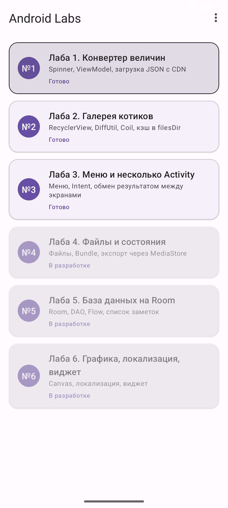
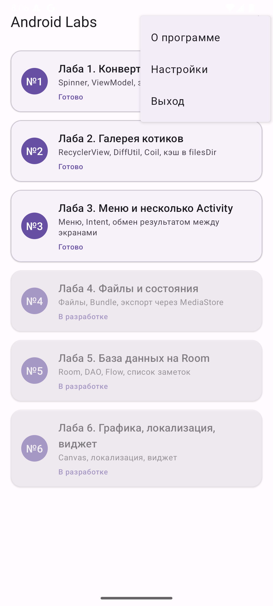
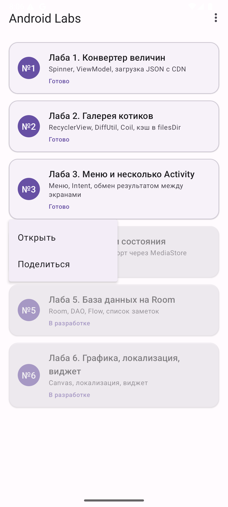
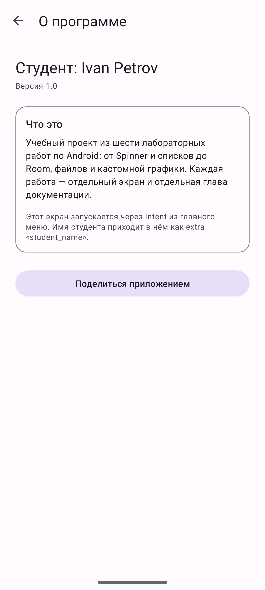
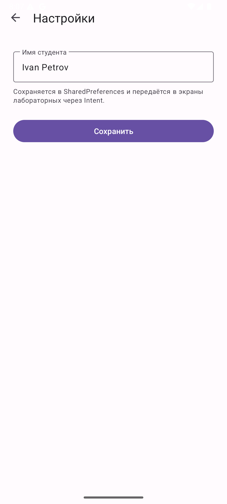
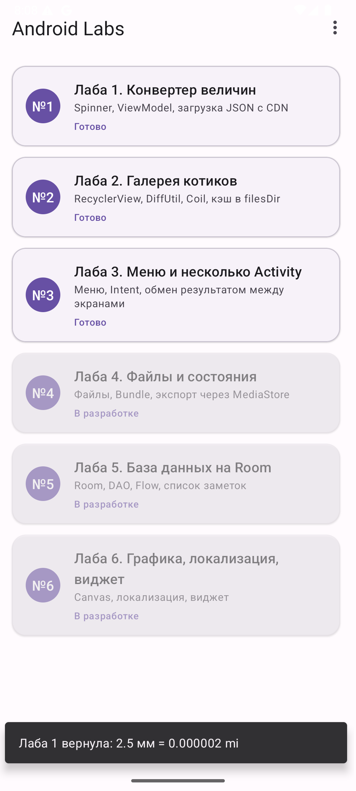
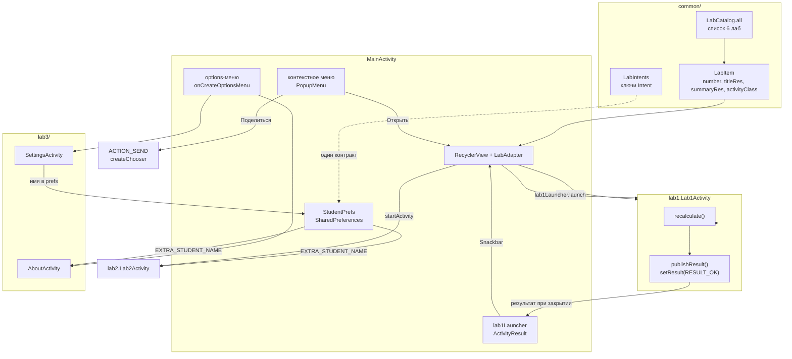
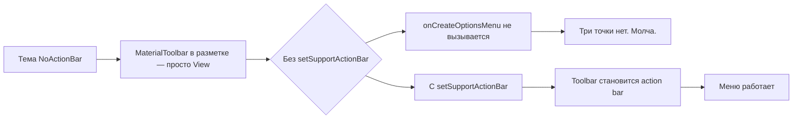

# Лабораторная 3. Меню и несколько Activity

> **Сложность:** средняя · **Время:** 2–2.5 часа · **Тег:** `lab3-v1.0`
> **Итог:** главный экран превратился в список всех шести лабораторных, у него есть
> options-меню и контекстное меню, а экраны обмениваются данными через `Intent`.


---

## 🎯 Цель работы

> Сделать главный экран приложения списком лабораторных работ. Реализовать
> options-меню («О программе», «Настройки», «Выход»), контекстное меню по
> долгому нажатию на пункт списка («Открыть», «Поделиться»), передачу данных
> между экранами через `Intent.putExtra` и возврат результата обратно через
> `registerForActivityResult`.

| | |
|---|---|
| **Что делаем** | Список из 6 лаб в `RecyclerView`, три пункта options-меню, контекстное меню, передача имени студента в другие экраны и возврат результата из Лабы 1 |
| **Чему учимся** | `options-меню` и `menu.xml`, `PopupMenu` и контекстное меню, `Intent` и `Bundle` как способы передачи данных, `ActivityResultContracts.StartActivityForResult`, `SharedPreferences` |
| **Итоговый навык** | Понимать, чем «навигация» отличается от «данных», и почему строка в `putExtra` — это контракт, а не деталь реализации |

## 📚 Что изучим

- `MenuInflater`, `menu/menu_main.xml`, `app:showAsAction="never"`
- `onCreateOptionsMenu` и `onOptionsItemSelected`
- `PopupMenu` как контекстное меню для `RecyclerView`
- `Intent`: `putExtra` / `getStringExtra` и почему ключи выносят в отдельный объект
- `ActivityResultContracts.StartActivityForResult` вместо устаревшего `startActivityForResult`
- `setResult` и `RESULT_OK` / `RESULT_CANCELED`
- `SharedPreferences` для настроек, которые переживают перезапуск
- `android:parentActivityName` — «родитель» для системной кнопки «назад» и Up

---

## 🖼️ Что получится


| Экран | Скриншот |
|-------|----------|
| Список лабораторных |  |
| Options-меню |  |
| Контекстное меню |  |
| О программе |  |
| Настройки |  |
| Результат, вернувшийся из Лабы 1 |  |

---

## 🧠 Архитектура



Два решения, на которых держится вся лаба:

1. **Список лаб — данные, а не вёрстка.** `LabCatalog.all` возвращает `List<LabItem>`,
   и его можно проверить обычным unit-тестом без Android. Недоступные лабы
   присутствуют в списке с `activityClass = null` — пользователь видит все шесть
   работ и понимает, что приложение не сломано.
2. **Ключи `Intent` живут в `LabIntents`.** Строка `"student_name"`, написанная
   в двух файлах, — это неявный контракт, который ломается без ошибок компиляции.

---

## 🧠 Теория

### 3.1 Два разных вида меню

| | Options-меню | Контекстное меню |
|---|---|---|
| Как открыть | Кнопка «три точки» в тулбаре | Долгое нажатие на элемент |
| Когда уместно | Действия над **экраном** | Действия над **элементом** |
| Колбэк | `onOptionsItemSelected` | обработчик, который вы сами назначили |
| Файл | `res/menu/menu_main.xml` | `res/menu/menu_lab_item.xml` |

Ключевое слово — «элемент». Пункт «Поделиться» в options-меню бессмысленен: чем
вы собираетесь делиться, если не выбран конкретный пункт списка? А «О программе»
в контекстном меню списка лаб — тем более.

### 3.2 `Intent` как конверт

`Intent` передаёт между экранами три вещи: **что** открыть, **как** открыть и
**какие данные** положить с собой.

```kotlin
Intent(this, AboutActivity::class.java).apply {
    putExtra(LabIntents.EXTRA_STUDENT_NAME, prefs.studentName)
}
```

На чтении:

```kotlin
val studentName = intent.getStringExtra(LabIntents.EXTRA_STUDENT_NAME).orEmpty()
```

`getStringExtra` возвращает `String?`, поэтому **всегда** нужен `.orEmpty()` —
иначе Kotlin заставит обработать `null`, а пользователь увидит падение вместо
пустого поля.

> 📌 `Intent` — одноразовый конверт между двумя конкретными запусками. Если данные
> нужны «всегда», это не `Intent`, а `ViewModel` или `SharedPreferences`.

### 3.3 Как отдать результат обратно

```kotlin
private val lab1Launcher = registerForActivityResult(
    ActivityResultContracts.StartActivityForResult()
) { result ->
    val lastValue = result.data?.getStringExtra(LabIntents.EXTRA_LAST_VALUE)
}
```

А на стороне Лабы 1:

```kotlin
setResult(RESULT_OK, Intent().putExtra(LabIntents.EXTRA_LAST_VALUE, result))
```

`startActivityForResult(requestCode)` и `onActivityResult(requestCode, …)` —
устаревшие способы с магическим числом вместо контракта. Activity Result API
избавляет от «у меня `requestCode == 42`, значит это оттуда», из-за чего в старых
проектах и терялись результаты.

### 3.4 Регистрация колбэка — только до `STARTED`

`registerForActivityResult` можно вызвать **только** до `onStart()`. Если
подписаться позже (например, из обработчика кнопки), Android выбросит
`IllegalStateException`, потому что результат может прийти раньше, чем подписка
появится. Поэтому колбэк объявляют **полем класса**: поля инициализируются при
создании Activity, то есть заведомо раньше.

---

## 🛠 Реализация

### Шаг 1. Модель лабораторной

[`common/LabItem.kt`](../android/app/src/main/java/ru/devcustrom/androidlab/common/LabItem.kt):

```kotlin
data class LabItem(
    val number: Int,
    val titleRes: Int,
    val summaryRes: Int,
    val activityClass: Class<out Activity>?,
) {
    val isAvailable: Boolean get() = activityClass != null
}
```

`activityClass` — `Class<?>`, а не `String` с именем экрана: так компилятор
проверит, что класс существует и что он `Activity`.

### Шаг 2. Список как данные

`LabCatalog.all` собирает шесть лаб. Лабы 4–6 пока имеют `activityClass = null`.

### Шаг 3. Options-меню

`res/menu/menu_main.xml`:

```xml
<item android:id="@+id/action_about"   android:title="@string/menu_about"   app:showAsAction="never" />
<item android:id="@+id/action_settings" android:title="@string/menu_settings" app:showAsAction="never" />
<item android:id="@+id/action_exit"    android:title="@string/menu_exit"    app:showAsAction="never" />
```

`showAsAction="never"` — пункт **никогда** не показывается в тулбаре, только в
раскрывающемся меню. Для трёх пунктов это правильно: иконки «назад» и «выход»
не существует, а «три точки» на 1080p всё равно прячется в оверфлоу.

### Шаг 4. Контекстное меню

Адаптер сообщает позицию и `View`-якорь, `MainActivity` показывает `PopupMenu`:

```kotlin
private fun showLabMenu(item: LabItem, anchor: View) {
    val popup = PopupMenu(this, anchor)
    popup.menuInflater.inflate(R.menu.menu_lab_item, popup.menu)
    (popup.menu as? ContextMenu)?.setHeaderTitle(getString(item.titleRes))
    popup.setOnMenuItemClickListener { … }
    popup.show()
}
```

### Шаг 5. Передача данных

`putExtra` в `MainActivity`, `getStringExtra` в `AboutActivity`. Имя хранится в
`SharedPreferences` (`StudentPrefs`), чтобы переживать перезапуск приложения.

### Шаг 6. Возврат результата

Лаба 1 отдаёт строку результата, главный экран показывает её в `Snackbar` и
пишет в logcat.

---

## 🐛 Что пошло не так (грабли)

### Грабля 1. Меню не появляется, а ошибок нет

**Симптом:** `menuInflater.inflate(R.menu.menu_main, menu)` отрабатывает, но кнопки
«три точки» на тулбаре нет. `uiautomator dump` показывает тулбар и кнопку
`More options` в `content-desc` — а по нажатию ничего не происходит.

**Причина:** тема приложения — `Theme.Material3.DayNight.NoActionBar`. Тулбар из
разметки сам по себе **не является** action bar, поэтому `onCreateOptionsMenu` у
`AppCompatActivity` вообще не вызывается. Никаких исключений: метода просто
никто не зовёт.

**Что сделано:**

```kotlin
setSupportActionBar(binding.toolbar)
```



> 📌 Это самая коварная из граблей лабы: нет ни ошибки, ни лога, ни краша.
> Если «меню не работает» — проверьте первым делом, назначен ли тулбар.

### Грабля 2. `RecyclerView` не отдаёт позицию нажатой строки

**Симптом:** `registerForContextMenu(labsList)` работает, меню всплывает, но
выбрать «Открыть» для нужной лабы невозможно — позиция неизвестна.

**Причина:** у `RecyclerView` **нет** переопределения `getContextMenuInfo()`,
поэтому в `onCreateContextMenu(menu, view, info)` приходит `info == null`.
`info.itemId` — это приём из `AdapterView`, где такая логика есть, а у
`RecyclerView` её нет вообще.

**Что сделано:** позицию знает только адаптер — он берёт её из
`bindingAdapterPosition`. Долгое нажатие обрабатывается в адаптере, а меню
показывается через `PopupMenu` с якорем-`View`.

```kotlin
root.setOnLongClickListener { view ->
    onLongClick(item, view)
    true
}
```

### Грабля 3. Сигнатура `onCreateContextMenu` изменилась

**Симптом:**

```
'onCreateContextMenu' overrides nothing. Potential signatures for overriding:
fun onCreateContextMenu(p0: ContextMenu!, p1: View!, p2: ContextMenu.ContextMenuInfo!)
```

**Причина:** код из старых туториалов написан как
`onCreateContextMenu(menu: Menu, …)`. В актуальном API первый параметр —
`ContextMenu`. Логика была верной, не совпадала только сигнатура.

**Что сделано:** параметр заменён на `ContextMenu`. Отдельно всплыло, что
`setHeaderTitle` тоже живёт не на `Menu`, а на `ContextMenu`, поэтому в
`PopupMenu` нужен каст: `(popup.menu as? ContextMenu)?.setHeaderTitle(…)`.

### Грабля 4. `setResult` в `onPause` не доходит

**Симптом:** Лаба 1 считает `7.5 мм = 0.000005 mi`, нажимаешь «назад» — а
колбэк получает `RESULT_CANCELED` и `data == null`. При этом `logcat` показывает,
что `setResult` **был вызван**.

**Причина:** «правильный» и очень типичный в статьях приём:

```kotlin
override fun onPause() {
    super.onPause()
    if (!isFinishing) return
    setResult(RESULT_OK, intent)   // ← уже поздно
}
```

На проверенной версии Android результат к моменту `onPause` при закрытии уже не
доходит до вызывающей стороны. Лог доказал: `onPause: isFinishing=true result='7.5 мм = 0.000005 mi'`,
а на той стороне `code=0`.

**Что сделано:** `setResult` вызывается **сразу после расчёта**, а не на выходе:

```kotlin
val result = UnitConverter.convert(value, from, to)
binding.resultText.text = getString(R.string.lab1_result_format, …)
publishResult(binding.resultText.text.toString())
```

Плюс `clearResult()` (`setResult(RESULT_CANCELED)`), когда ввод очищен или
некорректен, — иначе главный экран получал бы результат по умолчанию, который
пользователь уже стёр.

> 📌 Хранить результат в поле и отдавать «на выходе» кажется аккуратнее, но
> ровно эта схема и не сработала. `setResult` — это не «письмо, которое
> отправляется при выходе», а **состояние**, которое должно быть корректным
> всегда.

### Грабля 5. `private companion object` прячет ключ от соседнего экрана

**Симптом:** `MainActivity` обращается к `Lab1Activity.EXTRA_LAST_VALUE`, а
компилятор не видит константу.

**Причина:** я сначала положил ключ в `private companion object` Лабы 1 «чтобы не
светить наружу всё остальное». Но `private companion` делает приватными **все**
его члены, включая нужный.

**Что сделано:** все ключи `Intent` вынесены в отдельный публичный объект
[`common/LabIntents.kt`](../android/app/src/main/java/ru/devcustrom/androidlab/common/LabIntents.kt).
Побочная выгода: контракт между экранами виден в одном файле.

### Грабля 6. `BuildConfig` недоступен без флага

**Симптом:** `Unresolved reference 'BuildConfig'` при попытке показать версию на
экране «О программе».

**Причина:** в AGP 9 генерация `BuildConfig` выключена по умолчанию; включается
флагом `buildFeatures { buildConfig = true }`.

**Что сделано:** версия читается из установленного пакета, без изменения Gradle:

```kotlin
private fun versionName(): String = runCatching {
    packageManager.getPackageInfo(packageName, 0).versionName
}.getOrNull() ?: "—"
```

Кстати, так и правильнее: версия всё равно хранится в манифесте, и
`PackageInfo` — это тот же источник, а не вторая копия константы.

### Грабля 7. Мёртвый пункт «Настройки»

**Симптом:** пункт меню есть, а открывать нечего.

**Причина:** в плане Лабы 3 экрана «Настройки» нет — он нужен только как
переключатель языка в Лабе 6. Оставить пункт без действия — значит отдать
пользователю кнопку, которая ничего не делает.

**Что сделано:** добавлен [`lab3/SettingsActivity.kt`](../android/app/src/main/java/ru/devcustrom/androidlab/lab3/SettingsActivity.kt)
с полем «Имя студента». Он не выдуман: именно это имя Лаба 3 передаёт в другие
экраны через `Intent`, так что пункт меню делает реальную работу.

---

## 🤔 Разбор решений

| Решение | Почему так | Что было бы вместо |
|---------|-----------|-------------------|
| Список лаб в `LabCatalog` объекте | Данные, а не вёрстка; покрывается тестом | Список прямо в `MainActivity` |
| `activityClass: Class<*>?` вместо `String` | Компилятор проверяет существование и тип | `getStringExtra("activity")` + рефлексия |
| Лабы 4–6 видны, но неактивны | Честно: список не выглядит сломанным | Спрятать недоступные пункты |
| `PopupMenu`, а не `registerForContextMenu` | У `RecyclerView` нет `getContextMenuInfo()` | `info.itemId` из `AdapterView` (всегда `null`) |
| Обработка долгого нажатия в адаптере | Только там известна точная позиция | Угадывать позицию по нажатому `View` |
| Ключи `Intent` в `LabIntents` | Контракт в одном месте | Строки в двух файлах |
| `SharedPreferences` для имени | Переживает перезапуск приложения | `Bundle` (живёт только до поворота) |
| `ActivityResultContracts` | Контракт вместо `requestCode` | Устаревший `startActivityForResult` |
| `setResult` сразу при расчёте | `onPause` на закрытии не срабатывает | `setResult` в `onPause` |
| `finishAffinity()` в «Выход» | Закрывает всё приложение | `finish()` — закрыл бы только текущий экран |
| `ACTION_SEND` + `createChooser` | Системный выбор приложения | `startActivity(send)` — упадёт без дефолта |

---

## 🧪 Как проверить

```bash
cd android
./gradlew test assembleDebug
adb install -r app/build/outputs/apk/debug/app-debug.apk
```

1. Главный экран: шесть карточек, у 4–6 пометка «В разработке», нажатие на них
   показывает Snackbar.
2. Три точки → три пункта: «О программе», «Настройки», «Выход».
3. Настройки → ввести имя → «Сохранить».
4. Три точки → «О программе» → вверху «Студент: <имя>», ниже «Версия 1.0».
5. Долгое нажатие на карточку → «Открыть» / «Поделиться» с заголовком-именем лабы.
6. Лаба 1 → ввести `2.5` → «назад» → Snackbar «Лаба 1 вернула: …».
   Проверить в logcat: `adb logcat -s MainActivity`.
7. Лаба 1: очистить поле → «назад» → Snackbar **не** появляется, в logcat
   `Lab1Activity ничего не вернула`.

---

## ✅ Чек-лист сдачи

- [ ] Главный экран — `RecyclerView` со всеми шестью лабами
- [ ] Недоступные лабы видны, помечены и не открываются
- [ ] Options-меню содержит три пункта и работает
- [ ] «Выход» закрывает приложение целиком
- [ ] Контекстное меню открывается долгим нажатием и знает, какая строка нажата
- [ ] В контекстном меню есть «Открыть» и «Поделиться» с заголовком
- [ ] Имя студента сохраняется и переживает перезапуск
- [ ] Имя приходит в «О программе» через `getStringExtra`
- [ ] Лаба 1 возвращает результат, `MainActivity` его показывает
- [ ] Пустой ввод в Лабе 1 не возвращает старый результат
- [ ] Все ключи `Intent` лежат в `LabIntents`
- [ ] `setSupportActionBar` вызывается, иначе меню не появится
- [ ] Скриншоты и GIF лежат в `docs/assets/lab3-*`

---

## 🔗 Полезные ссылки

- [Меню в Android](https://developer.android.com/guide/topics/ui/menus)
- [Добавляем меню в `Activity`](https://developer.android.com/guide/topics/ui/menus#xml)
- [`PopupMenu`](https://developer.android.com/reference/androidx/appcompat/widget/PopupMenu)
- [Регулярное выражение: строка с `%` внутри `XML`](https://developer.android.com/guide/topics/resources/more-resources) — про `%1$s`
- [`Intent`](https://developer.android.com/reference/android/content/Intent)
- [`ActivityResultContracts.StartActivityForResult`](https://developer.android.com/reference/androidx/activity/result/contract/ActivityResultContracts.StartActivityForResult)
- [Запуск одной Activity с результатом](https://developer.android.com/training/components/activity-result-contracts)
- [`SharedPreferences`](https://developer.android.com/training/data-storage/shared-preferences)
- [`registerForContextMenu`](https://developer.android.com/reference/android/app/Activity#registerForContextMenu(android.view.View))

---

## 📌 Коммиты лабы

| Хэш | Описание |
|-----|----------|
| `docs(lab1,lab2)` | Mermaid-диаграммы и недостающие разделы в документации Лаб 1–2 |
| `feat(lab3)` | Список лабораторных, options-меню, контекстное меню, `Intent`, возврат результата |
| `lab3-v1.0` | Тег: Лаба 3 завершена |