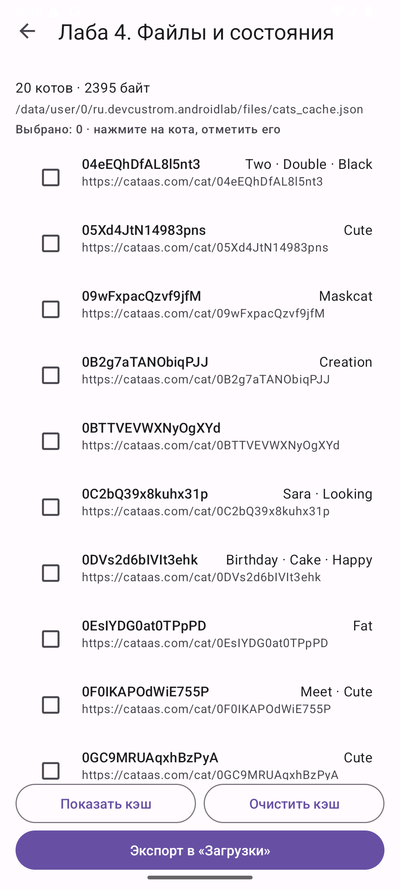
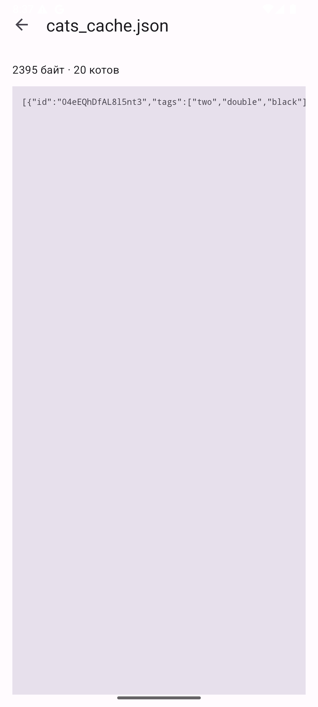
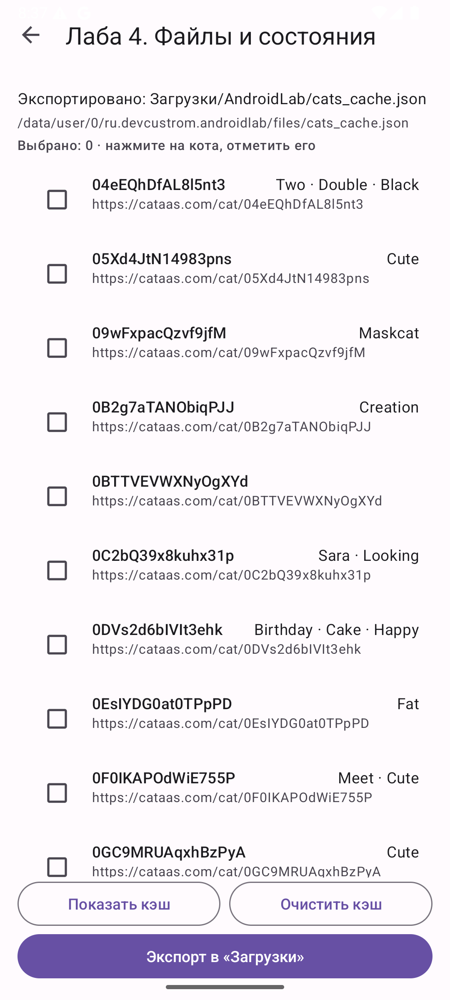
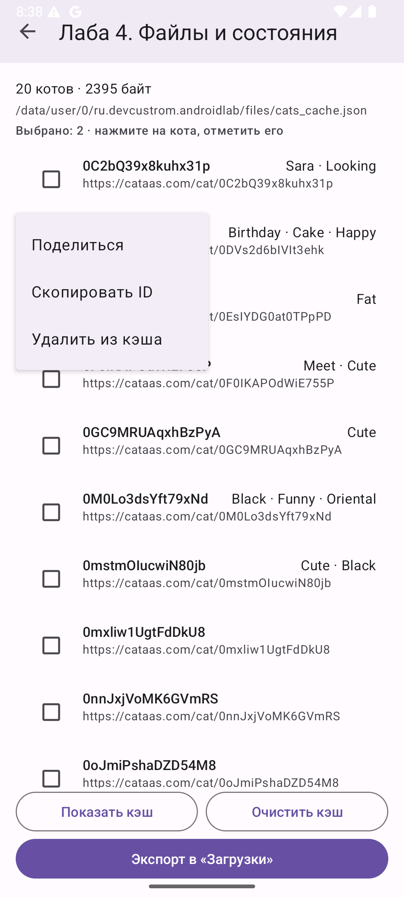
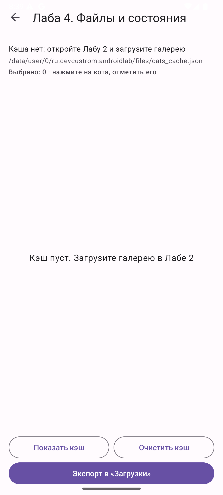
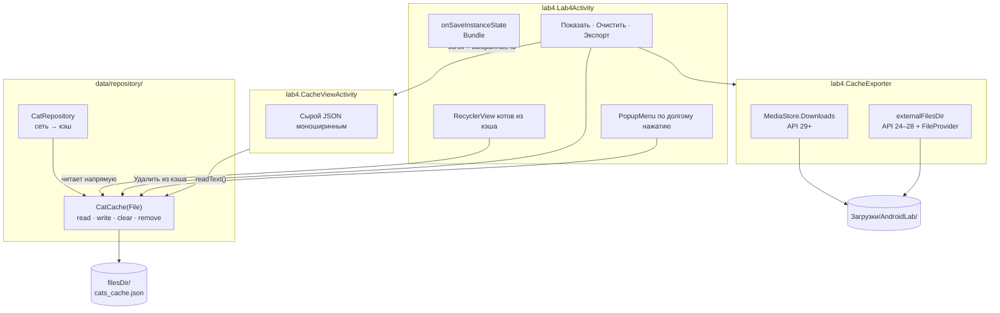
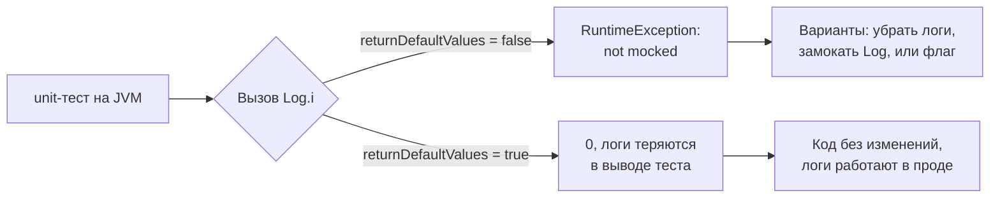

# Лабораторная 4. Файлы, кэш, сохранение состояния

> **Сложность:** средняя · **Время:** 2.5–3 часа · **Тег:** `lab4-v1.0`
> **Итог:** экран, который читает `cats_cache.json` из `filesDir`, показывает его
> содержимое, экспортирует в «Загрузки» через `MediaStore` и переживает поворот
> экрана вместе с позицией скролла и отметками.


---

## 🎯 Цель работы

> Разобраться, чем «состояние экрана» отличается от «сохранённых данных», научиться
> читать и писать файлы во внутреннем хранилище, экспортировать файл наружу без
> разрешений и восстанавливать состояние интерфейса после пересоздания Activity.

| | |
|---|---|
| **Что делаем** | Экран «Файлы и состояние»: список котов из кэша, просмотр сырого JSON, очистка, экспорт в «Загрузки», контекстное меню с тремя действиями |
| **Чему учимся** | `filesDir` vs `externalFilesDir` vs `MediaStore`, `onSaveInstanceState` и `Bundle`, `FileProvider`, `MediaStore.Downloads` |
| **Итоговый навык** | Отличать «данные, которые надо сохранить в файл» от «состояния, которое надо восстановить в `Bundle`» — и не путать их в одном `onSaveInstanceState` |

## 📚 Что изучим

- Внутреннее хранилище: `context.filesDir` — доступ без разрешений, удаляется вместе с приложением
- `File.readText()` / `writeText()` и почему `JSONObject` тут лишний
- `onSaveInstanceState(outState: Bundle)` — что класть, а что нельзя
- `onRestoreInstanceState` против `savedInstanceState` в `onCreate` — разные моменты вызова
- `putInt` / `putStringArrayList` и почему массив, а не `List`
- Позиция скролла: `findFirstVisibleItemPosition` + `scrollToPositionWithOffset`
- `MediaStore.Downloads` + `RELATIVE_PATH` + `IS_PENDING` на API 29+
- Почему `WRITE_EXTERNAL_STORAGE` запрашивать не нужно и что его заменило
- `FileProvider` и `FileUriExposedException`

---

## 🖼️ Что получится


| Экран | Скриншот |
|-------|----------|
| Список котов из кэша |  |
| Просмотр сырого JSON |  |
| Экспорт в «Загрузки» |  |
| Контекстное меню кота |  |
| Состояние после очистки |  |

---

## 🧠 Архитектура



Три решения, на которых держится лаба:

1. **`CatCache` принимает `File`, а не `Context`.** Благодаря этому 17 тестов на кэш
   работают без эмулятора и Robolectric. Это не про красоту: пока класс требует
   `Context`, единственный способ его проверить — `androidTest`, то есть медленно.
2. **Лаба 4 не ходит в сеть.** Только файл. Сеть живёт секунды, файл — до очистки
   данных приложения. Экран «про файлы» не должен внезапно ломаться, когда
   `cataas.com` лежит.
3. **`CatRepository` и `CatCache` разделены.** Репозиторий знает про сеть, кэш — про
   файл. Экран Лабы 4 пользуется кэшем, не поднимая сетевой слой.

---

## 🧠 Теория

### 4.1 Три места, где может лежать файл

| Где | Как достать | Разрешение | Удалишь приложение |
|-----|-------------|-----------|-------------------|
| `filesDir` | `File(context.filesDir, "x.json")` | не нужно | файл исчезнет |
| `cacheDir` | `File(context.cacheDir, "x")` | не нужно | файл исчезнет |
| `externalFilesDir` | `getExternalFilesDir(DIRECTORY_DOWNLOADS)` | не нужно | файл исчезнет |
| `Environment.getExternalStorageDirectory()` | **только с разрешением** | `WRITE_EXTERNAL_STORAGE` | файл останется |

Для временных данных приложения последняя строка — ловушка: разрешение deprecated
с API 29, а на API 30+ всё равно не даст писать в чужие каталоги. Правильный ответ —
`filesDir` или `MediaStore`.

### 4.2 `Bundle` — это не «сохранение данных»

Самое частое непонимание вокруг `onSaveInstanceState`. Два разных вопроса:

| Вопрос | Механизм | Когда нужно |
|--------|----------|-------------|
| «Что пользователь **наделал**?» | Файл / БД / `SharedPreferences` | Должно пережить перезапуск |
| «Где был **курсор**?» | `Bundle` + `onSaveInstanceState` | Достаточно пережить поворот |

Отметка «кот выбран» — это состояние интерфейса: после перезапуска приложения
смысла её восстанавливать нет. А вот `SharedPreferences` с именем студента —
это данные, их надо сохранять на диск, а не в `Bundle`. В Лабе 3 так и сделано.

> 📌 `Bundle` система держит в памяти процесса, а при нехватке памяти
> **сериализует на диск**. Поэтому большой `Bundle` — это не «медленно», это
> `TransactionTooLargeException` при входе в фон на слабом устройстве.

### 4.3 Что класть в `outState`

```kotlin
outState.putInt(STATE_SCROLL, first)                        // int: 4 байта
outState.putStringArrayList(STATE_SELECTED, ArrayList(set)) // массив, а не List
```

Почему `StringArrayList`, а не `putSerializable` со `List<String>`: `Bundle`
однозначно умеет `ArrayList<String>` и не требует класса, реализующего
`Serializable`. А список `Cat` через `Serializable` — это уже ~20 КБ на элемент и
прямой путь к `TransactionTooLargeException`.

### 4.4 Экспорт через `MediaStore` без разрешения

```kotlin
val values = ContentValues().apply {
    put(MediaStore.Downloads.DISPLAY_NAME, fileName)
    put(MediaStore.Downloads.MIME_TYPE, "application/json")
    put(MediaStore.Downloads.RELATIVE_PATH, "Download/AndroidLab")
    put(MediaStore.Downloads.IS_PENDING, 1)   // пока не показываем пользователю
}
val uri = resolver.insert(MediaStore.Downloads.EXTERNAL_CONTENT_URI, values)
resolver.openOutputStream(uri)!!.use { out -> source.inputStream().copyTo(out) }
// … и только потом снимаем IS_PENDING
```

`IS_PENDING` — не формальность. Без него пользователь увидит в «Загрузках»
полупрозрачный файл нулевого размера, а через секунду — нормальный. Если
приложение убьют посреди записи, останется мусор в его «Downloads».

---

## 🛠 Реализация

### Шаг 1. `CatCache` — файл как данные

[`data/repository/CatCache.kt`](../android/app/src/main/java/ru/devcustrom/androidlab/data/repository/CatCache.kt)
принимает `File` в конструкторе и ничего не знает про Android:

```kotlin
class CatCache(private val file: File) {
    fun exists(): Boolean = file.exists()
    fun sizeBytes(): Long = if (file.exists()) file.length() else 0L
    fun read(): List<Cat>? = runCatching { … }.getOrNull()
    fun write(cats: List<Cat>) { runCatching { … } }
    fun clear(): Boolean = runCatching { file.delete() }.getOrDefault(false)
    fun remove(id: String): Boolean
}
```

Все файловые операции обёрнуты в `runCatching`. Кэш — не критичный путь: если он
не читается, приложение должно показать «нет кэша», а не упасть.

### Шаг 2. Экран Лабы 4

[`lab4/Lab4Activity.kt`](../android/app/src/main/java/ru/devcustrom/androidlab/lab4/Lab4Activity.kt)
не ходит в сеть — читает `repository.cache` напрямую. Файловые операции уходят в
`Dispatchers.IO`, результат возвращается в `lifecycleScope`.

### Шаг 3. Просмотр JSON

[`lab4/CacheViewActivity.kt`](../android/app/src/main/java/ru/devcustrom/androidlab/lab4/CacheViewActivity.kt)
показывает `cache.readText()` моноширинным шрифтом внутри `HorizontalScrollView`.
JSON длиннее экрана, поэтому оба скролла нужны.

### Шаг 4. Экспорт

[`lab4/CacheExporter.kt`](../android/app/src/main/java/ru/devcustrom/androidlab/lab4/CacheExporter.kt)
разветвляется по версии: `MediaStore` на API 29+, `externalFilesDir` + `FileProvider`
раньше.

### Шаг 5. Сохранение состояния

```kotlin
override fun onSaveInstanceState(outState: Bundle) {
    super.onSaveInstanceState(outState)
    val first = (binding.catsList.layoutManager as? LinearLayoutManager)
        ?.findFirstVisibleItemPosition() ?: 0
    outState.putInt(STATE_SCROLL, first)
    outState.putStringArrayList(STATE_SELECTED, ArrayList(cacheAdapter.selected))
}
```

---

## 🐛 Что пошло не так (грабли)

### Грабля 1. `Log.i` в классе, который тестируется, роняет все тесты

**Симптом:** 17 новых тестов на `CatCache` падают все до одной, одинаково:

```
java.lang.RuntimeException: Method i in android.util.Log not mocked.
    at android.util.Log.i(Log.java)
    at ru.devcustrom.androidlab.data.repository.CatCache.write(CatCache.kt:48)
```

**Причина:** обычные unit-тесты работают на JVM, где `android.jar` — это заглушки:
все методы `throw new RuntimeException("not mocked")`. Настоящий `Log` доступен
только в Robolectric или на устройстве.

**Что сделано:** в `build.gradle.kts` включён флаг:

```kotlin
testOptions {
    unitTests { isReturnDefaultValues = true }
}
```

Методы заглушек начинают возвращать `0`/`false` вместо исключения. Три варианта
было — убрать логи, замокать `Log` или этот флаг; выбран третий, потому что
диагностика в проде стоит дороже одного флага. Побочный эффект честно записан
в комментарии к флагу: тест не заметит, если код начнёт **читать** результат
`Log`. Читать его нельзя.



### Грабля 2. `contextMenu` не привязан к позиции элемента

**Симптом:** ровно как в Лабе 3, но на новом экране: `registerForContextMenu`
не даёт понять, какой кот нажат.

**Причина:** `RecyclerView` не переопределяет `getContextMenuInfo()`, поэтому
`onCreateContextMenu` получает `info == null`.

**Что сделано:** обработка долгого нажатия осталась в адаптере
(`CacheCatAdapter`), а меню показывается через `PopupMenu` с якорем-`View`.

### Грабля 3. Самоссылка адаптера в конструкторе

**Симптом:**

```
e: Lab4Activity.kt:41:29 Type checking has run into a recursive problem.
e: Lab4Activity.kt:41:42 Unresolved reference 'toggleSelection'.
```

**Причина:** я инициализировал адаптер лямбдой, которая обращается к самому адаптеру:

```kotlin
private val cacheAdapter = CacheCatAdapter(
    onToggle = { cat -> cacheAdapter.toggleSelection(cat.id) },  // ← самоссылка
)
```

Kotlin не может вывести тип: чтобы вызвать `toggleSelection`, нужен тип адаптера,
а чтобы вывести тип, нужно разобрать лямбду, а в лямбде — обращение к адаптеру.
Замкнутый круг.

**Что сделано:** указан явный тип и лямбда заменена на метод —

```kotlin
private val cacheAdapter: CacheCatAdapter = CacheCatAdapter(
    onToggle = ::toggleCat,
)

private fun toggleCat(cat: Cat) {
    cacheAdapter.toggleSelection(cat.id)
    updateSelectedInfo()
}
```

### Грабля 4. JSON в `tools:text` ломает XML

**Симптом:**

```
[Fatal Error] activity_cache_view.xml:58:32: Element type "TextView" must be
followed by either attribute specification s, ">" or "/>".
```

**Причина:** разметка для подсказки в редакторе:

```xml
tools:text="[{"id":"60b1a2f5","tags":["black"]}]" />
```

Кавычки внутри значения атрибута закрывают его досрочно — XML становится
невалидным.

**Что сделано:** экранирование — `&quot;` или `&apos;`. Отдельно полезно знать:
для **текстовых** ресурсов (в `strings.xml`) кавычки экранировать не нужно,
для **атрибутов разметки** — всегда.

### Грабля 5. `android:scrollbars="both"` не существует

**Симптом:**

```
error: 'both' is incompatible with attribute scrollbars
(flags [horizontal=256, none=0, vertical=512])
```

**Причина:** флаг `both` есть у `View`, но не у `HorizontalScrollView`.

**Что сделано:** `android:scrollbars="horizontal"`. Для `VerticalScrollView` —
`vertical`. Флаг `both` доступен только в `<HorizontalScrollView>` внутри
`ScrollView` (двумерный скролл).

### Грабля 6. Дубликат строки в `strings.xml`

**Симптом:**

```
ERROR: strings.xml: Found item String/lab4_summary more than one time
```

**Причина:** `lab4_summary` уже существовал — он был нужен `LabCatalog` ещё с Лабы 3,
хотя сама лаба не была написана. Я добавил вторую копию.

**Что сделано:** оставил одну. Побочный вывод: если ресурс уже есть и им пользуется
`LabCatalog`, значит он был заведён заранее — и удалять его, «потому что лаба ещё
не готова», нельзя.

### Грабля 7. Пустой список в кэше и файл, который существует

**Симптом:** после удаления последнего кота в кэше остаётся `[]`, экран показывает
«кэш пуст», а в интерфейсе — «20 котов».

**Причина:** файл существует, но данных в нём нет.

**Что сделано:** `remove()` удаляет сам файл, если котов не осталось. Для приложения
`[]` и отсутствие файла равнозначны, но «файла нет» честнее показывается
пользователю. Это же зафиксировано тестом
`удаление последнего кота убирает сам файл`.

---

## 🤔 Разбор решений

| Решение | Почему так | Что было бы вместо |
|---------|-----------|-------------------|
| `CatCache(File)` вместо `CatCache(Context)` | 17 тестов без эмулятора | `androidTest` на устройстве |
| `runCatching` вокруг каждой файловой операции | Кэш не критичен, падать нельзя | проброс `IOException` в UI |
| Лаба 4 читает только кэш | Экран про файлы, а не про сеть | дёргать CATAAS при открытии |
| `onSaveInstanceState` + `reload()` читает файл заново | Видно, что файл правда на диске | держать список в поле |
| Только `scroll` и `id` в `Bundle` | Дёшево собрать и вернуть | класть туда весь список котов |
| `ArrayList<String>` вместо `Serializable` | `Bundle` умеет это без классов | `putSerializable(list)` |
| `MediaStore` + `RELATIVE_PATH` | Файл видит пользователь, разрешение не нужно | `WRITE_EXTERNAL_STORAGE` |
| `IS_PENDING` при записи | Пользователь не видит обрезанный файл | вставлять сразу «видимым» |
| `FileProvider` для API < 29 | `Uri.fromFile` бросает `FileUriExposedException` | отдать `file://` и упасть |
| Удаление файла при пустом кэше | «Файла нет» честнее, чем `[]` | оставлять пустой массив |
| Отдельные `CacheViewActivity` и `Lab4Activity` | Экран JSON — это другой вопрос | показывать JSON диалогом |
| `HorizontalScrollView` + моноширинный шрифт | JSON длиннее и шире экрана | `ellipsize="end"` |

---

## 🧪 Как проверить

```bash
cd android
./gradlew test assembleDebug
adb install -r app/build/outputs/apk/debug/app-debug.apk
```

1. Открыть Лабу 2 → дождаться загрузки → кэш создан (20 котов).
2. Открыть Лабу 4 → видно список котов, размер и **абсолютный путь** файла.
3. Отметить двух котов, прокрутить список, повернуть экран → отметки на месте,
   позиция скролла восстановлена.
   В logcat: `adb logcat -s Lab4Activity` → `onSaveInstanceState: scroll=5, выбрано=2`.
4. «Показать кэш» → сырой JSON моноширинным шрифтом.
5. «Экспорт в «Загрузки»» → файл появляется в `Download/AndroidLab/`:

   ```bash
   adb shell ls -l /sdcard/Download/AndroidLab/
   adb logcat -s CacheExporter   # content://media/external/downloads/84
   ```

6. Долгое нажатие на кота → «Поделиться» / «Скопировать ID» / «Удалить из кэша».
7. «Очистить кэш» → файл удалён, экран показывает «Кэш пуст».

### Тесты

```bash
./gradlew test     # 36 тестов: 11 + 8 + 17
```

---

## ✅ Чек-лист сдачи

- [ ] Список котов читается из `filesDir/cats_cache.json`, а не из сети
- [ ] На экране видны количество котов, размер и абсолютный путь файла
- [ ] «Показать кэш» открывает сырой JSON
- [ ] Экспорт попадает в `Download/AndroidLab/` без единого разрешения
- [ ] `IS_PENDING` снимается только после успешной записи
- [ ] Для API < 29 используется `externalFilesDir` + `FileProvider`
- [ ] Контекстное меню знает, какой кот нажат
- [ ] «Удалить из кэша» переписывает файл
- [ ] Удаление последнего кота удаляет файл, а не оставляет `[]`
- [ ] «Очистить кэш» удаляет файл, экран показывает пустое состояние
- [ ] Поворот экрана сохраняет позицию скролла и отметки
- [ ] В `Bundle` лежат только `int` и `ArrayList<String>`
- [ ] `CatCache` покрыт тестами без Android
- [ ] В `build.gradle.kts` есть `testOptions.unitTests.isReturnDefaultValues`
- [ ] Скриншоты и GIF лежат в `docs/assets/lab4-*`

---

## 🔗 Полезные ссылки

- [Хранилище данных приложения](https://developer.android.com/training/data-storage)
- [`filesDir` vs `cacheDir` vs external](https://developer.android.com/training/data-storage/app-specific)
- [`onSaveInstanceState`](https://developer.android.com/reference/android/app/Activity#onSaveInstanceState(android.os.Bundle))
- [`Bundle`](https://developer.android.com/reference/android/os/Bundle)
- [Состояние интерфейса: восстановление после поворота](https://developer.android.com/guide/topics/resources/runtime-changes)
- [`TransactionTooLargeException` и `Bundle`](https://developer.android.com/guide/topics/activity/memory#WarningAvoidLargeBuffers)
- [`MediaStore.Downloads`](https://developer.android.com/reference/android/provider/MediaStore.Downloads)
- [Создание файлов в общих коллекциях](https://developer.android.com/training/data-storage/shared/media)
- [`IS_PENDING` и незавершённые записи](https://developer.android.com/training/data-storage/shared/media#create-write-publish-media)
- [`FileProvider`](https://developer.android.com/reference/androidx/core/content/FileProvider)
- [`FileUriExposedException`](https://developer.android.com/training/data-storage/shared/fileprovider)
- [Юнит-тесты: `returnDefaultValues`](https://developer.android.com/studio/test/unit-tests#return-default-values)

---

## 📌 Коммиты лабы

| Хэш | Описание |
|-----|----------|
| `refactor(cats)` | Вынести файловые операции кэша в `CatCache(File)` — их стало можно тестировать |
| `feat(lab4)` | Экран файлов и состояния, просмотр JSON, экспорт через `MediaStore`, `FileProvider` |
| `lab4-v1.0` | Тег: Лаба 4 завершена |